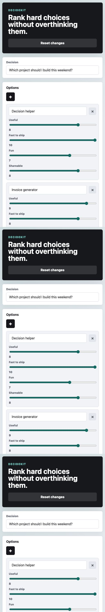

# DecideKit

Rank hard choices with weighted criteria, option scoring, and a live summary.



## Features

- Add, edit, and remove options
- Add, edit, and weight decision criteria
- Score each option against every criterion
- Reset all weights and scores to zero
- Copy a ranked summary to the clipboard

## Run Locally

Open `index.html` in a browser, or serve the folder with:

```sh
python3 -m http.server 4173
```

Then visit `http://localhost:4173`.
